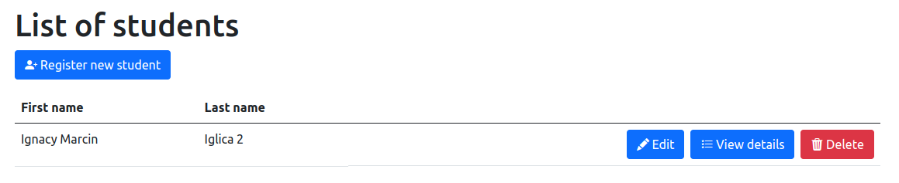

# Grade Tracker
This is an app made with **ASP.NET 6.0** using MVC template. It uses **SQLite** for database.

## Main features
- Managing students
- Managing teachers
- Creating subjects for students to attend and for teachers to teach
- Adding grades for students

## Running the app
This app requires **.NET SDK version 6.0**. Make sure you have it installed by running `dotnet --version`. To launch the app locally, clone the repo and enter the folder:
```
git clone https://github.com/vroniu/grade-tracker.git
cd grade-tracker
```
Then, lauch the app and head to the URL shown in console.
```
dotnet run
```
## Documentation

### **What does this app do?**
This app allows you to manage a school system - including students, teachers, subjects and grades.

### **Features overview**
- **Main page**

    Once you launch the application, you will be greeted by the main screen. You can click the buttons on the cards or use the navbar up top to navigate the app.

    
- **Students page**

    By clicking the link on the main page or on the navabar, you can navigate to the students page. There you will see a list of all students.

    

    You can click the button to add a student, or use the 'Edit' button to edit existing ones. If you want to see what subjects is the student attening, click on the 'View details' button:
    

- **Teachers page**

    The teachers page is similiar to the students page. The main difference is that it shows what subjects is the teachers teaching upon clicking the 'View details' button:
    

- **Subjects page**

    When creating or editing a subject, you can select what student and teachers will be assigned to that subject.

    

    That information will then show on the details page.

    

- **Grades page**

    The grades page shows all the grades, including which student got it, which teacher gave it and in which subject it was given. The grades have different backgrounds depending on their value to improve readibility.

    


